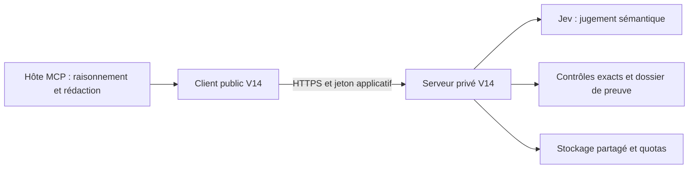

# Smart-Thinking V14 — client MCP distant

**Version `14.1.0`.** Ce dépôt contient le **client public**
de Smart-Thinking. Le serveur V14, les décisions Jev, les preuves, les politiques
et l'infrastructure GCP sont maintenus séparément dans le dépôt privé autorisé.

> Migration majeure : le point d'entrée `smart-thinking-mcp` ne démarre plus le
> serveur V13 local. Un endpoint V14 déployé et un jeton applicatif sont requis.
> Endpoint de production : `https://smart-thinking-v14-923774092927.northamerica-northeast1.run.app/mcp`.
> Un jeton individuel délivré par l’opérateur reste obligatoire ; aucun secret fournisseur ne va dans le client.

## Démarrer

Node.js **22.16.0 ou plus récent**. Aucun module fournisseur ni Python n'est
nécessaire chez l'utilisateur. Pour installer le client publié :

```bash
npm install -g smart-thinking-mcp@14.1.0
```

Pour développer depuis les sources :

```bash
npm ci
npm run check
node bin/smart-thinking.mjs --help
```

Configurer une URL fournie par l'opérateur et un **fichier** contenant votre jeton
MCP, hors du dépôt. Ce jeton n'est jamais la clé TypeSafe/Jev.

```bash
export SMART_THINKING_MCP_URL="https://smart-thinking-v14-923774092927.northamerica-northeast1.run.app/mcp"
export SMART_THINKING_MCP_TOKEN_FILE="$HOME/.config/smart-thinking/token"
# Créer le fichier avec l'outil sécurisé de l'opérateur, puis :
chmod 600 "$SMART_THINKING_MCP_TOKEN_FILE"
node bin/smart-thinking.mjs
```

Le processus utilise stdin/stdout pour MCP. Le silence après démarrage est normal :
il attend les messages de l'hôte. Pour un contrôle explicite de connectivité :

```bash
npm run doctor
```

Le doctor vérifie protocole, catalogue et profil API, **pas** une inférence Jev.

## Connecter un hôte MCP

```json
{
  "mcpServers": {
    "smart-thinking": {
      "command": "node",
      "args": ["/CHEMIN/Smart-Thinking/bin/smart-thinking.mjs"],
      "env": {
        "SMART_THINKING_MCP_URL": "https://smart-thinking-v14-923774092927.northamerica-northeast1.run.app/mcp",
        "SMART_THINKING_MCP_TOKEN_FILE": "/CHEMIN/PRIVE/token"
      }
    }
  }
}
```

Le chemin historique `clients/remote-mcp/bridge.mjs` reste utilisable. L'export
JavaScript du paquet expose `RemoteConnection`, pas l'ancien moteur local.

## Rôle de chaque composant



Jev aide à interpréter, prioriser et évaluer des passages. Il ne génère pas à lui
seul les preuves formelles. Les autorisations et budgets ne sont pas confiés au
modèle. Les mesures réelles et leurs limites sont publiées dans [le bilan de version](docs/RELEASE_V14.md). Aucun multiplicateur de qualité n’est garanti.

## Accès Cloud Run privé

L'authentification applicative reste dans `Authorization`. L'identité IAM Google
peut être ajoutée séparément dans `X-Serverless-Authorization`. Choisir l'une des
sources suivantes, jamais les deux :

| Configuration | Valeur attendue |
|---|---|
| `SMART_THINKING_ID_TOKEN_FILE` | Fichier de jeton d'identité Google renouvelé par l'opérateur. |
| `SMART_THINKING_IAM_SERVICE_ACCOUNT` + `SMART_THINKING_IAM_AUDIENCE` | Compte **client** dédié à impersonner et URL IAM du service récepteur, sans `/mcp`. Requiert `gcloud` et les autorisations appropriées. |

Le compte client doit pouvoir invoquer le service. Ne pas distribuer le compte
runtime ni un fichier de clé de compte de service. L'accès public authentifié
supprime éventuellement le contrôle IAM d'invocation, jamais le jeton applicatif.

## Contrat et limites

Profil `smart-thinking-mcp/14.0`, Streamable HTTP **stateless avec réponses JSON**.
Les versions négociées sont `2025-03-26`, `2025-06-18` et `2025-11-25`. Les sessions
stateful et les flux SSE sont rejetés explicitement, non simulés. Ce client ne
réalise pas de connexion OAuth interactive et ne renouvelle pas de refresh token.

Les requêtes sont limitées à 256 000 octets, les réponses à 1 600 000 octets, avec
huit requêtes simultanées et un délai de 115 secondes. Une mutation n'est jamais
réessayée automatiquement. Après un timeout, consulter son reçu `operation_get`
avant de répéter. `run_cancel` est l'annulation durable ; l'annulation locale ne
garantit pas l'arrêt d'un appel déjà reçu par une autre instance serveur.

## Migration, sécurité et publication

[Migration V13 → V14](docs/MIGRATION.md) · [Architecture](docs/ARCHITECTURE.md) ·
[Sécurité](docs/SECURITY.md) · [Contrat machine](contracts/v14.json) ·
[Tests et validation](docs/TESTS.md).

Le client est publié sur npm sous `smart-thinking-mcp@14.1.0`. La publication
exécute les tests et le contrôle de séparation public/privé. Le serveur reste privé.
Aucune clé, donnée de session ou archive privée ne doit être ajoutée à ce dépôt public.

La V13 reste disponible dans l'historique au commit
`a2dd4e6d926e50f8244b061f6ec97c90e5db62bb`. La supprimer de l'arbre courant ne retire
pas son ancien code de l'historique, des forks ni des versions npm déjà publiées.
