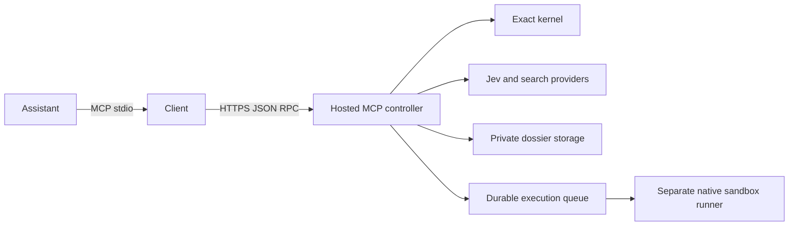

# Client architecture

The npm package contains a transport client, not the engine. It has no runtime npm dependencies.

`bridge.mjs` validates local JSON-RPC, maps request IDs, bounds concurrency and handles cancellation. `connection.mjs` handles HTTPS, initialization, credential files and response limits. The shared discovery function follows every catalogue page, checks duplicate names and cursor loops, and verifies the advertised fingerprint **before** filtering a tool profile. `doctor.mjs` uses that same discovery path.

The wire profile is `smart-thinking-mcp/16.0`. The additive 16.1 catalogue contains 43 tools, including `code_index`. `contracts/tools.json` is generated from the engine's executable contract. `contracts/release.json` is shared with the engine and website; `contracts/v14.json` remains a historical compatibility fixture.

The server handles ownership, permissions, quotas and evidence. The client preserves bounded typed errors, including quota details. HTTP 200 with `isError: true` remains a tool failure. Neither model scores nor the client can override an uncovered obligation.

See [connection settings](CONFIGURATION.md), [data handling](SECURITY.md) and [validation](TESTS.md).
