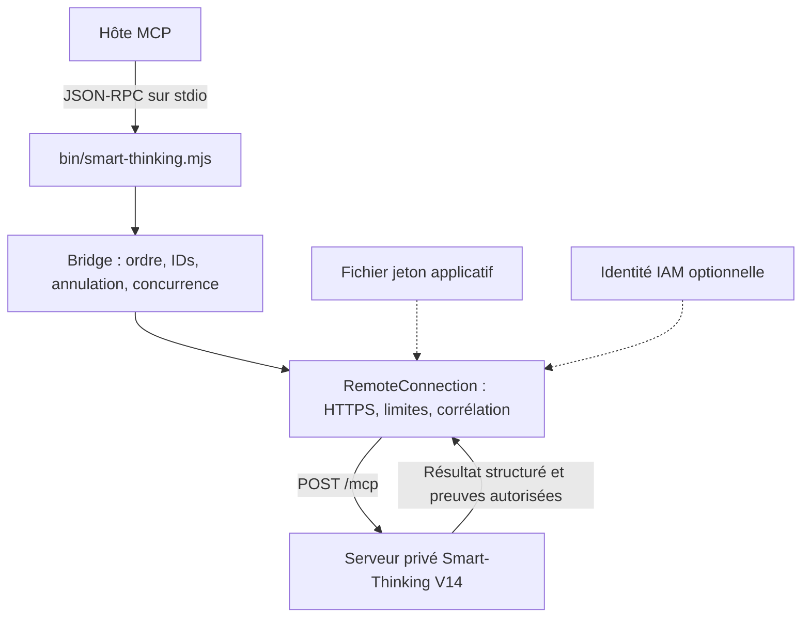

# Architecture du client public V14

`protocol.mjs` valide les enveloppes et les versions explicitement prises en
charge. `connection.mjs` relit le jeton à chaque appel, refuse redirections et
sessions incompatibles, borne corps et temps, et ne rejoue pas de mutation.
`bridge.mjs` remappe les identifiants de l'hôte, attend l'initialisation complète,
et propage les annulations sans exposer les identifiants internes à d'autres
requêtes. Le client ne décide pas de la vérité d'une affirmation.

Le serveur est responsable de l'identité métier, de l'isolation des dossiers,
des quotas transactionnels, des appels fournisseurs et de la vérification.
Le jeton applicatif n'est pas une clé TypeSafe. Le serveur ne renvoie pas ses
prompts privés dans `tools/list` : seuls les contrats publics sont exposés.

Le contrat `contracts/v14.json` est vérifié lors de la recette inter-dépôts du
serveur. Une évolution incompatible doit changer son profil majeur et ne pas se
cacher derrière la même version. L'API publique reste une interface de capacités,
pas une promesse de disponibilité d'un service non encore déployé.

Références primaires :
- https://modelcontextprotocol.io/specification/2025-11-25/basic/transports
- https://docs.cloud.google.com/run/docs/authenticating/service-to-service
- https://docs.typesafe.ai/introduction
