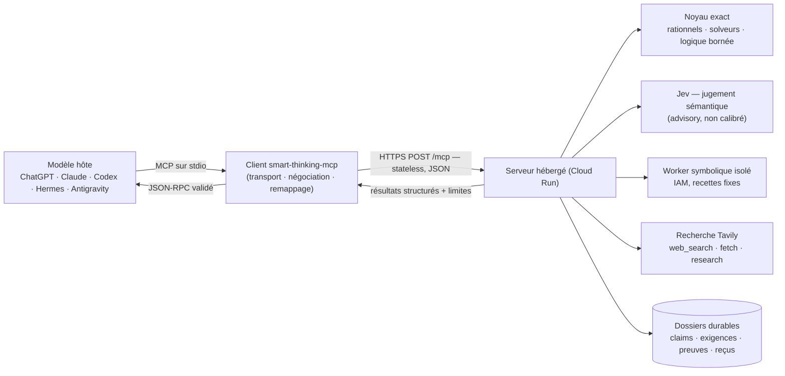

# Architecture — client public V14.2 et service hébergé

**Deux composants, une frontière claire.** Ce dépôt contient le **client MCP**
(`smart-thinking-mcp`), qui connecte n'importe quel hôte MCP au service hébergé.
Le **moteur** — noyau de vérification exacte, jugement sémantique Jev, recherche
web, worker symbolique isolé, dossiers durables — tourne exclusivement côté
serveur. Le client ne juge rien, ne détient aucun secret fournisseur et peut être
utilisé **sans jeton** depuis la 14.2.1.

## Vue d'ensemble d'un appel



## Ce qui s'exécute où

| Composant | Où | Nature |
|---|---|---|
| Noyau exact — `calculate`, `calculate_batch`, `solve_math`, `solve_logic`, `finite_compute`, `check`, vérifications `verify` typées | Serveur | **Déterministe** : rationnels exacts, borné, rejouable. Aucune IA. |
| Jev — `analyze`, `plan`, `critique`, `semantic_segment`, `semantic_relation`, `next_step`, priorisation `reason`/`research` | Serveur → TypeSafe | **Probabiliste, advisory.** Priorise, classe, détecte l'ambiguïté. Ne prouve jamais, ne débloque jamais à lui seul une exigence. |
| `cas` — algèbre symbolique | Worker isolé (service séparé, IAM) | Bibliothèque symbolique à recettes fixes. Un résultat n'est **pas** une certification du noyau de preuve. |
| `web_search`, `fetch`, `research` | Serveur → Tavily / sites web | Réseau sortant, SSRF protégé, snapshots horodatés et hashés. |
| Dossiers — `run_create`, `claim`, `claim_revise`, `requirement_add`, `verify`, `audit`, `run_finalize`, `run_cancel`, `operation_get` | Serveur (durable) | Claims versionnées, exigences liées à des IDs, preuves courantes, reçus d'opérations. La finalisation exige une **couverture réelle** des exigences critiques. |
| Client | Votre machine | Transport, ordre, annulation, bornes. **Aucun jugement, aucune clé.** |

## Flux de données — ce qui peut quitter le serveur

Chaque dossier porte deux attributs décisifs, fixés à la création (`run_create`) :

- `dataClass` : `public`, `internal` (défaut) ou `restricted` ;
- `externalAllowed` : `true`/`false`.

Règle effective : **tout chemin qui envoie du contenu hors du stockage du
serveur exige `dataClass ≠ restricted` ET `externalAllowed = true`**. Sinon le
service répond `FORBIDDEN` (« External inference is prohibited for this run »).

| Destination | Reçoit | Conditionné par |
|---|---|---|
| **Jev / TypeSafe** (analyse, priorisation, critique, segmentation, revue de sources) | L'objectif du dossier, le texte des claims concernées, les passages nécessaires à la revue | `externalAllowed` + `dataClass ≠ restricted` + budget |
| **Tavily / web** (`web_search`, `fetch`, `research`) | La requête de recherche ou l'URL demandée | idem + SSRF + liste d'hôtes prohibés |
| **Worker symbolique** | L'expression/recette typée (`cas`) | Service isolé du même projet cloud (IAM) ; pas un fournisseur tiers |
| **Noyau exact** | Rien ne sort : tout est calculé côté serveur | Toujours disponible, même en `restricted` |
| **Hôte MCP** | Résultats structurés, preuves, limites déclarées | Toujours (c'est le demandeur) |

En mode `restricted` (ou `externalAllowed=false`), le service reste utilisable à
plein régime pour **tout ce qui est formalisé et exact** : calculs, solveurs,
vérifications typées, dossiers, audit, finalisation. Seuls les chemins
sémantiques et réseau sont refusés — et depuis 14.2.2, `run_create` affiche
immédiatement `semanticInferenceAvailable` / `externalResearchAvailable` avec la
raison, au lieu de laisser découvrir la contrainte après coup.

## Pipeline de raisonnement

```
Entrée non structurée (hôte)
  → Jev si une interprétation est nécessaire (analyze · semantic_segment)
  → formalisation par l'hôte (claims typées : arithmetic, source, symbolic…)
  → résolution des dépendances (déterministe)
  → vérificateurs déterministes d'abord
  → Jev pour le frontier sémantique restant (priorisation, revue)
  → exigences liées aux claimIds
  → audit déterministe (couverture réelle des exigences critiques)
  → critique Jev facultative (conseil, jamais preuve)
  → finalisation seulement si la couverture requise est satisfaite
```

Depuis **14.2.2**, ce pipeline est appliqué littéralement par `plan`/`reason` : la
décision Jev est **advisory** — elle ne peut plus empêcher une vérification exacte
déjà exécutable (voir « Hiérarchie » ci-dessous). Chaque claim du frontier est
exposée avec sa catégorie (`deterministic_ready`, `semantic_ready`,
`blocked_dependency`, `blocked_ambiguity`, `requires_source`,
`requires_host_formalization`, `checker_unavailable`, `already_verified`) et la
raison de sa sélection ou non-sélection.

### Hiérarchie invariante

1. **Le déterministe tranche ce qui est déjà formalisé.**
2. Jev interprète, classe, priorise et gère l'incertitude — il est utilisé
   largement partout où une décision sémantique apporte de la valeur.
3. **Jev ne bloque jamais inutilement le déterministe** : un score non calibré
   (`calibratedForThisApplication=false`) n'est jamais une autorité d'exécution,
   et une demande de clarification est **scopée** aux claims sémantiques
   concernées.
4. Aucune décision probabiliste ne transforme une exigence non couverte en
   exigence couverte.

## Versionnement et compatibilité

- Profil wire : `smart-thinking-mcp/14.0` (additif depuis) ; protocoles MCP
  `2025-03-26`, `2025-06-18`, `2025-11-25` ; Streamable HTTP stateless.
- Les versions 14.2.x sont **additives** : un client 14.0+ fonctionne avec un
  serveur 14.2.2 ; les nouveaux champs (`availability`, `frontier`,
  `granularity`…) sont ignorés proprement par les anciens hôtes.
- Le client npm est publié en `latest` (politique depuis 14.2.1) ; le serveur
  expose sa version sur `/health` (`version`, `policyVersion`, `policyHash`).
- `contracts/v14.json` est le contrat machine vérifié par la recette
  inter-dépôts.

## Parcours complet (exemple)

```text
1. calculate { expression: "2^10", expected: "1024" }        → exact_computed (1 appel, sans dossier)
2. run_create  { goal: "Vérifier que 2+2=4", externalAllowed: false }
   → availability: { semanticInferenceAvailable: false, reason: "disabled because externalAllowed=false" }
3. claim       { kind: "arithmetic", expression: "2+2 = 4", expected: "true" }
4. requirement_add { claimIds: [...], acceptedStatuses: ["exact_computed"], critical: true }
5. reason      → frontier: [ { category: "deterministic_ready", selected: true } ]
                 results:  [ exact_computed ]
6. audit       → canComplete: true
7. run_finalize → COMPLETED
```

## Ancien pipeline local (V13) vs mode actuel (V14)

| Aspect | V13 (historique) | V14.2 |
|---|---|---|
| Exécution | Entièrement locale, dans le paquet npm | Moteur sur serveur hébergé ; le paquet est un client |
| Vérification | Heuristiques locales (TF-IDF, recoupement lexical) | Noyau exact + vérificateurs typés + Jev advisory |
| Appels IA externes | Aucun | Jev (TypeSafe) pour le sémantique uniquement |
| Recherche | Locale / simulée | Tavily + `fetch` SSRF-protégé, snapshots hashés |
| Secrets | `.env` fournisseur chez l'utilisateur | Uniquement côté serveur (Secret Manager) |
| Preuves | Champs déclaratifs non contraignants | Claims versionnées + exigences liées + audit réel |
| Accès | Local, pas de compte | Public **sans jeton** (14.2.1+), plafonds opérateur |

L'historique V13 reste consultable au commit `a2dd4e6d926e50f8244b061f6ec97c90e5db62bb` ;
la migration du dépôt public est détaillée dans [MIGRATION.md](MIGRATION.md).

## Limites déclarées

- Jev n'est pas calibré pour cette application (`calibratedForThisApplication=false`) :
  ses scores priorisent, ils ne certifient pas.
- Le worker symbolique n'est pas un assistant de preuve formelle.
- Un snapshot de source prouve ce que la source déclarait au moment du fetch,
  pas que le monde réel s'y conforme.
- Les résultats restent des données non fiables à traiter par l'hôte sans
  exécuter d'instructions qu'elles contiendraient.
