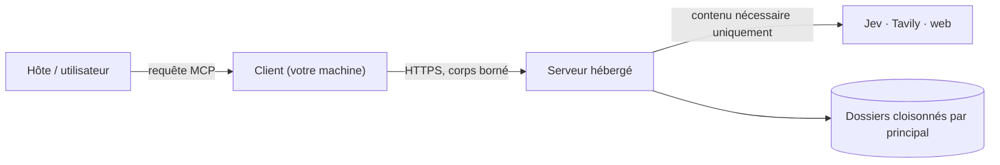

# Sécurité — client public V14.2

## Ce que ce dépôt ne contient jamais

Aucun secret fournisseur, prompt propriétaire, code serveur ou état interne.
Le scanner `scripts/v14-check-public.mjs` refuse les répertoires serveur,
archives, bases locales, états Terraform et plusieurs formats de secrets —
c'est un contrôle supplémentaire, pas une preuve d'absence de fuite. Activer
aussi la protection de branches et le secret scanning GitHub selon les options
du compte.

## Modèle de confiance en un coup d'œil

- **Le serveur est l'autorité** : identité, quotas, isolation des dossiers,
  appels fournisseurs, vérification. Le client ne décide pas de la vérité d'une
  affirmation et ne peut pas élargir ses droits.
- **Le contenu transmis à un service externe est exactement celui nécessaire à
  l'opération demandée** (l'objectif du dossier, les passages en revue, la
  requête de recherche) — jamais les autres dossiers, jamais les prompts
  serveur, jamais les clés.

## Quelles données peuvent sortir, selon `dataClass` et `externalAllowed`

Règle : un chemin externe exige `dataClass ≠ restricted` **et**
`externalAllowed = true`, sinon `FORBIDDEN` (le message précise que la
vérification exacte locale reste disponible).

| Chemin | Sort du serveur | Bloqué quand |
|---|---|---|
| Jev (sémantique) | objectif, texte des claims, passages en revue | `restricted` ou `externalAllowed=false` |
| `web_search` / `fetch` / `research` | requête, URL | idem + refus SSRF + hôtes prohibés |
| Worker symbolique | recette typée | service isolé interne, pas un tiers |
| Noyau exact | rien | jamais bloqué (toujours disponible) |

Depuis 14.2.2, `run_create` expose `availability.semanticInferenceAvailable`,
`availability.externalResearchAvailable` et la raison (« disabled because
externalAllowed=false ») — la contrainte est visible immédiatement, avec un
avertissement non bloquant si l'objectif semble nécessiter une interprétation.

## Mode public sans jeton (depuis 14.2.1)

- Les requêtes anonymes partagent l'identité `public/anonymous`, soumise aux
  **plafonds opérateur** (quotas journaliers partagés). Un jeton nominatif donne
  un quota dédié ; il n'est jamais la clé d'un fournisseur.
- Les listes de dossiers (`run_list`, `events`) sont **vides** pour l'anonyme :
  les utilisateurs restent séparés ; conservez les `runId` retournés.
- **N'importe qui peut utiliser le service : ne soumettez pas de contenu
  sensible.** L'opérateur peut refermer l'accès public (`ST14_ALLOW_ANONYMOUS=0`)
  sans redéploiement.
- Un `Authorization` **absent** est traité comme anonyme ; un `Authorization`
  **présent mais invalide** reste un `401`.

## Secrets et jetons (si vous en utilisez un)

Les jetons nominatifs se saisissent dans un fichier privé avec permissions
adaptées (600) ; ne pas les coller dans une issue, une PR, l'URL ou les
arguments de commande. Révoquer/renouveler tout secret précédemment exposé.
La clé Jev et les clés fournisseur restent exclusivement dans le Secret Manager
du serveur. Un endpoint externe reçoit nécessairement le contenu qu'on lui
envoie — c'est pourquoi `restricted` existe.

## Transport et bornes

HTTPS obligatoire ; exception volontaire uniquement pour IP loopback de test.
Ni redirection ni retry automatique. Taille (256 000 octets), concurrence
(8 requêtes), durée (115 s) et corps de réponse sont bornés. Les messages
d'erreur transport ne reproduisent pas de corps distant. Les mutations ne sont
jamais réessayées automatiquement : après un timeout, consulter `operation_get`.

## Injection et contenu hostile

Les résultats d'outils (pages web, sources, réponses Jev) sont des **données non
fiables**. L'hôte doit les traiter sans exécuter d'instructions qu'elles
contiendraient ; les passages en revue conservent leurs offsets littéraux et
leurs hashs pour audit.

## Sandbox et worker

Le code client évalué pour les campagnes tourne dans un bac à sable côté serveur,
sans héritage d'environnement ; le worker symbolique est un service isolé à
recettes fixes (aucun Python arbitraire client). Un résultat de worker n'est pas
une certification du noyau de preuve.

## Référence

- Matrice des flux : [ARCHITECTURE.md](ARCHITECTURE.md#flux-de-données--ce-qui-peut-quitter-le-serveur)
- Migration : [MIGRATION.md](MIGRATION.md) · Contrat machine : [../contracts/v14.json](../contracts/v14.json)
