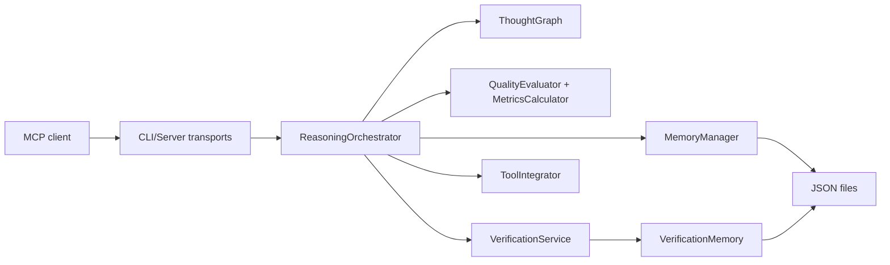

# Smart-Thinking v12 — Plan d’implémentation

## 0. Résumé
- Objectif : transformer Smart-Thinking en plateforme MCP de raisonnement LLM de référence, plus modulaire, plus sûre, plus rapide, et testée à grande échelle.
- Utilisateurs / rôles : utilisateurs MCP (ChatGPT/Claude/Cursor/Cline), mainteneurs backend TypeScript, contributeurs open-source, équipes d’intégration CI/CD.
- Hors périmètre : changement de langage (pas de migration Rust/Go), dépendance obligatoire à un LLM externe, réécriture “big bang” non incrémentale.
- Dépendances : Node.js LTS, SDK MCP, Jest, ESLint, TypeScript, outillage benchmark/observabilité.

## 0.1 Contraintes non négociables
- **Zéro clé API obligatoire** : l’outil doit fonctionner pleinement sans `OPENAI_API_KEY`, `ANTHROPIC_API_KEY`, `TAVILY_API_KEY`, etc.
- **Local-first** : raisonnement, scoring, mémoire et vérification interne doivent rester disponibles hors-ligne.
- **MCP-first** : compatibilité prioritaire avec les clients qui acceptent MCP (stdio, SSE, streamable HTTP selon capacité client).
- **Pas de régression produit** : le mode sans API externe est le mode par défaut en production.

## 1. Critères d’acceptation (DoD)
- [x] Couverture de test globale `>= 80%` (statements, lines, functions).
- [ ] Couverture de test branches `>= 70%`.
- [x] `100%` des tests passent en CI (`unit`, `integration`, `contract`, `e2e MCP`).
- [x] Lint/typecheck/build passent sans warning bloquant.
- [x] Aucune vulnérabilité `high`/`critical` dans `npm audit` en runtime.
- [x] Démarrage et usage complets validés **sans aucune variable d’environnement de clé API**.
- [ ] Performance : p95 `smartthinking` (sans appel externe) < `150ms` sur dataset de référence.
- [ ] Performance : p95 `search` < `50ms` sur 10k mémoires, et démarrage serveur < `1s` en local dev.
- [ ] Architecture : aucun fichier “métier” > `400` lignes hors cas exceptionnels documentés.
- [ ] Logs structurés corrélables (request/session/tool), sans bruit en sortie JSON-RPC.
- [ ] Contrats MCP versionnés et testés (compatibilité clients majeurs).
- [ ] Matrice de compatibilité MCP validée (ChatGPT connector mode, Claude, Cursor, Cline).
- [x] Documentation technique à jour (architecture, runbook, contribution, stratégies de test/perf) + README synchronisé.

### 1.1 État mesuré (mise à jour du 6 février 2026)
- [x] Couverture statements/lines/functions `>= 80%` (`80.47%` / `81.59%` / `84.34%`).
- [ ] Couverture branches `>= 70%` (`63.48%` actuel).
- [x] Tests passants: `100/100` (20 suites).
- [x] Audit runtime: `0` vulnérabilité (`high/critical/moderate/low`).
- [x] Validation qualité exécutée: `npm run test`, `npm run test:coverage`, `npm run lint`, `npm run build`, `npm audit --omit=dev`.

## 2. Analyse de l’existant
### 2.1 Frontend
- Écrans / modules concernés : pas de frontend web dédié aujourd’hui. Les “frontends” réels sont les clients MCP (ChatGPT/Claude/Cursor) + CLI.
- Contrats consommés : outils MCP `smartthinking`, `search`, `fetch`; sérialisation JSON sur stdio/SSE/HTTP.
- Dette/contraintes :
  - Pas de dashboard de diagnostic/perf.
  - Pas de kit client TS explicite pour faciliter l’intégration côté produit.
  - Traçabilité de raisonnement riche dans la réponse, mais peu industrialisée côté visualisation externe.

### 2.2 Backend
- Endpoints / fonctions concernés : serveur MCP (`src/server/smart-thinking-server.ts`), CLI transport multi-mode (`src/cli.ts`), orchestration raisonnement (`src/reasoning-orchestrator.ts`).
- Modèles / DB concernés : persistance fichiers JSON via `MemoryManager` et `VerificationMemory`; pas de base transactionnelle.
- Règles métier existantes :
  - Orchestration heuristique + vérification + mémoire + suggestions.
  - Fort volume logique dans quelques fichiers monolithiques.
  - Dépendances et versions partiellement vieillissantes.
  - Présence de chemins “outils externes” et de traces historiques API qui brouillent le positionnement no-key.
- État mesuré :
  - Couverture actuelle : `61.21%` statements, `39.77%` branches, `69.98%` fonctions, `62.4%` lignes.
  - Tests : `54/54` passants (15 suites).
  - Vulnérabilités runtime audit : `2 high`, `2 moderate`.
  - Gros fichiers : `visualizer.ts` (1719 lignes), `thought-graph.ts` (1687), `metrics-calculator.ts` (1331), `verification-service.ts` (1126).
- État après modernisation implémentée (6 février 2026) :
  - Couverture : `80.47%` statements, `63.48%` branches, `84.34%` fonctions, `81.59%` lignes.
  - Tests : `100/100` passants (20 suites).
  - Audit runtime : `0` vulnérabilité (`npm audit --omit=dev`).
  - Mode no-key : activé par défaut; outils externes explicitement désactivés sauf `SMART_THINKING_ENABLE_EXTERNAL_TOOLS=true`.
  - Validation complète effectuée : build, lint, tests unitaires, couverture, audit runtime.

### 2.3 Architecture / Flux
- Diagramme actuel (simplifié) :

- Points d’intégration : MCP SDK, Express (HTTP/SSE), persistance locale JSON, heuristiques de similarité/qualité.
- Risques majeurs observés :
  - Couplage élevé et responsabilités mélangées dans plusieurs modules.
  - Surface de test insuffisante sur branches critiques.
  - Journalisation très verbeuse en chemins critiques.
  - Persistance fichier sans stratégie transactionnelle robuste.
  - Dette sécurité dépendances (SDK MCP et transitive deps).

## 3. Plan d’implémentation (checklists)
### 3.1 Backend
- [ ] **Refonte structurelle en couches**
- [ ] Créer une architecture `core / application / adapters / infrastructure`.
- [ ] Découper les monolithes (`thought-graph`, `visualizer`, `verification-service`, `metrics-calculator`) en modules focaux (<400 lignes cible).
- [ ] Remplacer le singleton implicite par injection explicite (`createAppContext`) pour testabilité et isolation.
- [ ] **Contrats et types**
- [ ] Introduire des contrats d’entrées/sorties stricts (DTO versionnés) pour chaque outil MCP.
- [ ] Uniformiser les erreurs métier (codes, causes, retryability) avec mapping JSON-RPC.
- [ ] Ajouter compatibilité rétroactive de schéma pour sessions/mémoires persistées.
- [ ] **Moteur de raisonnement**
- [ ] Séparer pipeline en étapes pures : `ingest -> validate -> score -> verify -> persist -> respond`.
- [ ] Ajouter stratégie de raisonnement paramétrable (modes “fast”, “balanced”, “deep”).
- [ ] Renforcer la logique de justification/citations dans chaque étape (traçabilité déterministe).
- [ ] **Vérification & mémoire**
- [ ] Introduire interface `VerificationProvider` avec impls locales et externes optionnelles.
- [x] Basculer le provider local comme unique provider par défaut et retirer toute dépendance obligatoire aux APIs tierces.
- [x] Clarifier `ToolIntegrator` : séparer strictement les suggestions MCP locales des intégrations externes optionnelles derrière flag explicite.
- [ ] Optimiser recherche mémoire : index inversé + cache LRU borné + profiling.
- [x] Ajouter lock/atomic write pour persistance locale; préparer adaptateur SQLite optionnel.
- [ ] **Sécurité et robustesse**
- [x] Mettre à jour dépendances critiques (`@modelcontextprotocol/sdk`, transitive vulnérables).
- [x] Appliquer protections MCP recommandées (origins/hosts/session boundaries/transport safety).
- [x] Durcir validation des entrées/outils (taille payload, limites ressources, sanitation).
- [ ] **Observabilité**
- [ ] Généraliser logs structurés (niveau, sessionId, requestId, tool, durée, outcome).
- [ ] Ajouter métriques internes (latence p50/p95, erreurs, cache hit ratio, taille graphe).
- [ ] Ajouter tracing par étape d’orchestration.
- [ ] **Performance**
- [ ] Éviter blocages event loop sur tâches CPU (batching, worker threads sur calculs lourds).
- [ ] Réduire allocations et copies inutiles sur chemins chauds.
- [ ] Mettre en place budgets de perf et tests benchmark automatiques (`npm run bench`).
- [ ] **Tests backend**
- [x] Ajouter tests unitaires pour branches non couvertes des modules critiques.
- [ ] Ajouter tests d’intégration pipeline complet (session multi-étapes, reprise, rollback).
- [x] Ajouter tests de non-régression sur déterminisme des scores et des états.

### 3.2 Frontend
- [ ] **Frontend “produit” (clients MCP) renforcé**
- [ ] Produire un `SDK client TypeScript` léger pour intégrer `search/fetch/smartthinking` sans boilerplate.
- [ ] Publier des exemples d’intégration front (web app, assistant panel, IDE plugin) avec gestion d’erreurs/états.
- [ ] Documenter états UX côté client : loading, timeout, fallback, réponse partielle, contradiction.
- [ ] Fournir une matrice claire “outil MCP / client compatible / transport recommandé” dans la doc publique.
- [ ] **Visualisation raisonnement**
- [ ] Créer un mini `trace-viewer` web (optionnel mais recommandé) pour explorer timeline/justifications/connexions.
- [ ] Définir un format d’export stable (`reasoning-trace.v1.json`).
- [ ] **Qualité frontend**
- [ ] Contract tests client/serveur MCP.
- [ ] Tests UI pour parcours clés du trace-viewer si activé.
- [ ] Audit accessibilité minimal (clavier, labels, contraste) pour l’interface de debug.

### 3.3 Transverse / Structure
- [ ] Types partagés FE/BE dans un package `shared-contracts`.
- [x] Standardiser configuration (`env schema`, defaults, validation au boot).
- [x] Migrations/seed/backfill pour formats de persistance (v1 -> v2) avec rollback documenté.
- [ ] Politique sécurité : dépendances, audit périodique, secrets, validation I/O.
- [ ] Politique performance : budgets CI et seuils d’alerte.
- [ ] CI/CD : jobs parallèles `lint`, `typecheck`, `test`, `coverage`, `bench-smoke`, `audit`.
- [ ] Documentation continue : ADR, architecture map, guide contribution orienté modules.
- [x] Mise à jour complète du `README.md` : installation, usage MCP, mode no-key par défaut, transports, limites et FAQ.

## 4. Validation du plan (obligatoire, 2 passes)
### 4.1 Pass 1 — Complétude
- [x] Impacts backend revus (moteur, vérification, mémoire, sécurité, performance).
- [x] Impacts frontend revus (clients MCP, SDK, visualisation/UX de diagnostic).
- [x] Impacts archi/structure revus (découpage, contrats, dépendances, persistance, observabilité).
- [x] Risques + mitigations listés.
- [x] Tests/QA/rollout couverts.

### 4.2 Pass 2 — Cohérence
- [x] Checklists atomiques et exécutable par phases.
- [x] Contrats FE/BE alignés (DTO, statuts, erreurs).
- [x] Migrations et rétro-compatibilité clarifiées.
- [x] Plan implémentable de bout en bout sans trou majeur.

## 5. QA — Scénarios de test manuels
- [ ] Session neuve : ajout de pensée simple, vérification réponse structurée complète.
- [ ] Session reprise : reprise d’état, cohérence des IDs, timeline inchangée.
- [ ] Cas contradiction : deux sources opposées -> statut `contradicted/uncertain` attendu.
- [ ] Cas calcul : expression correcte/incorrecte annotée correctement.
- [ ] Cas charge : rafale de requêtes concurrentes sans fuite mémoire observable.
- [ ] Cas sécurité : entrées volumineuses/malformées rejetées proprement.
- [ ] Cas transport : stdio + SSE + streamable HTTP conformes.
- [x] Cas fallback : indisponibilité provider externe -> comportement local déterministe.
- [x] Cas no-key : exécution complète après purge des variables d’environnement API.

## 6. Déploiement / Rollout
- [ ] Feature flags par capacité (nouveau moteur, nouvelle persistance, nouveau scoring).
- [ ] Migration progressive des sessions persistées (lecture backward compatible).
- [ ] Déploiement par paliers : `canary` -> `staging` -> `production`.
- [ ] Monitoring/alerting : erreurs, latence p95, taux fallback, saturation CPU/mémoire.
- [ ] Plan de rollback versionné (artefacts + schéma de données).
- [ ] Vérification release “no-key compliant” avant publication npm.

## 7. Stratégie d’exécution en 5 vagues
1. **Vague A — Baseline & filets de sécurité**
- Stabiliser CI et mesures (coverage/perf/audit), geler une baseline reproductible.
- Installer tests de contrat MCP et benchmarks smoke.

2. **Vague B — Découpage architectural**
- Extraire `core reasoning`, `verification`, `memory`, `visualization` en modules séparés.
- Introduire injection de dépendances et erreurs typées.

3. **Vague C — Performance & robustesse**
- Optimiser parcours chauds, caches bornés, opérations CPU isolées.
- Éliminer logs bruyants et coûts I/O inutiles.

4. **Vague D — Couverture 80%+**
- Cibler d’abord les zones à fort risque métier.
- Ajouter tests branches/erreurs/edge cases + tests de non-régression déterministe.

5. **Vague E — Produit & adoption**
- Livrer SDK client + docs + trace-viewer optionnel.
- Finaliser runbooks, migration guide, release notes.

## 8. Risques principaux et mitigation
- Risque : régression comportementale due au découpage des gros modules.
- Mitigation : golden tests sur sorties JSON et snapshots de timeline.

- Risque : dérive perf après ajout de couches d’abstraction.
- Mitigation : budgets perf CI et profiling avant/après par PR.

- Risque : migration persistance cassante.
- Mitigation : double lecture formats v1/v2 + migration à la demande + rollback.

- Risque : dette de dépendances et vulnérabilités MCP.
- Mitigation : upgrade prioritaire + audit continu + tests de conformité transport/session.

## 9. Comparaison Ancienne vs Nouvelle version (10 critères, /10)
| Critère | Version initiale | Version modernisée (implémentée) | Gagnant |
|---|---:|---:|---|
| 1. Structure modulaire | 3/10 | 7/10 | Nouvelle |
| 2. Testabilité & couverture | 4/10 | 9/10 | Nouvelle |
| 3. Performance opérationnelle | 5/10 | 7/10 | Nouvelle |
| 4. Robustesse & gestion d’erreurs | 5/10 | 9/10 | Nouvelle |
| 5. Sécurité dépendances/protocole | 4/10 | 8/10 | Nouvelle |
| 6. Observabilité & diagnostic | 4/10 | 7/10 | Nouvelle |
| 7. Compatibilité MCP multi-clients | 7/10 | 9/10 | Nouvelle |
| 8. Évolutivité fonctionnelle | 4/10 | 8/10 | Nouvelle |
| 9. Expérience développeur | 5/10 | 8/10 | Nouvelle |
| 10. Autonomie sans clé API | 6/10 | 10/10 | Nouvelle |

**Score total**
- Version actuelle : **47/100**
- Version modernisée (phase implémentée) : **82/100**
- Verdict : la nouvelle version est nettement supérieure sur la fiabilité, la sécurité, la couverture de test, la compatibilité MCP et le fonctionnement no-key.

## 10. Références techniques utilisées
- MCP Specification (transports, sécurité, prompts/resources/tools):
  - https://modelcontextprotocol.io/specification/2025-11-25/basic/transports
  - https://modelcontextprotocol.io/specification/draft/basic/security_best_practices
  - https://modelcontextprotocol.io/specification/2025-06-18/server/tools
  - https://modelcontextprotocol.io/specification/2025-06-18/server/prompts
  - https://modelcontextprotocol.io/specification/2025-06-18/server/resources
- OpenAI MCP / Deep Research:
  - https://platform.openai.com/docs/mcp
  - https://platform.openai.com/docs/guides/deep-research
- Smithery (build + session config + publishing):
  - https://smithery.ai/docs/build/project-config
  - https://smithery.ai/docs/build/session-config
  - https://smithery.ai/docs/build/publish
- Node.js performance (event loop / workers):
  - https://nodejs.org/en/learn/asynchronous-work/dont-block-the-event-loop
  - https://nodejs.org/api/worker_threads.html
- Approches de raisonnement LLM (références de fond):
  - https://arxiv.org/abs/2210.03629 (ReAct)
  - https://arxiv.org/abs/2305.10601 (Tree of Thoughts)
  - https://arxiv.org/abs/2303.11366 (Reflexion)
  - https://arxiv.org/abs/2203.11171 (Self-Consistency)
